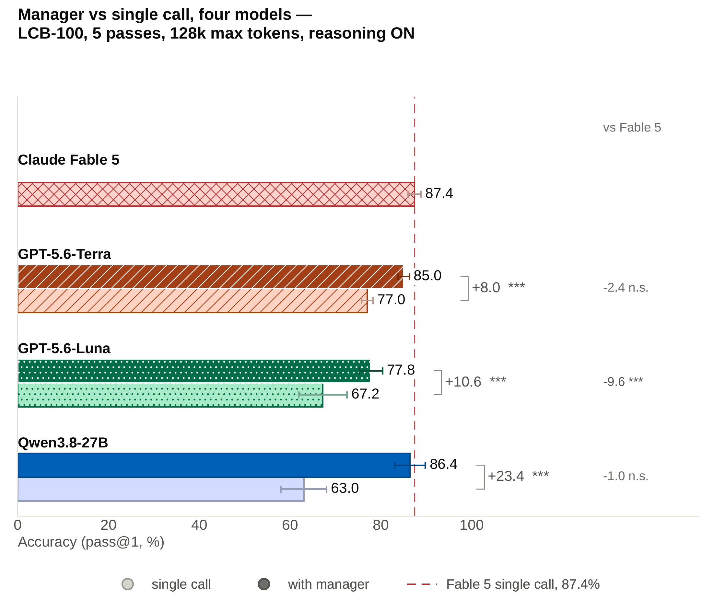
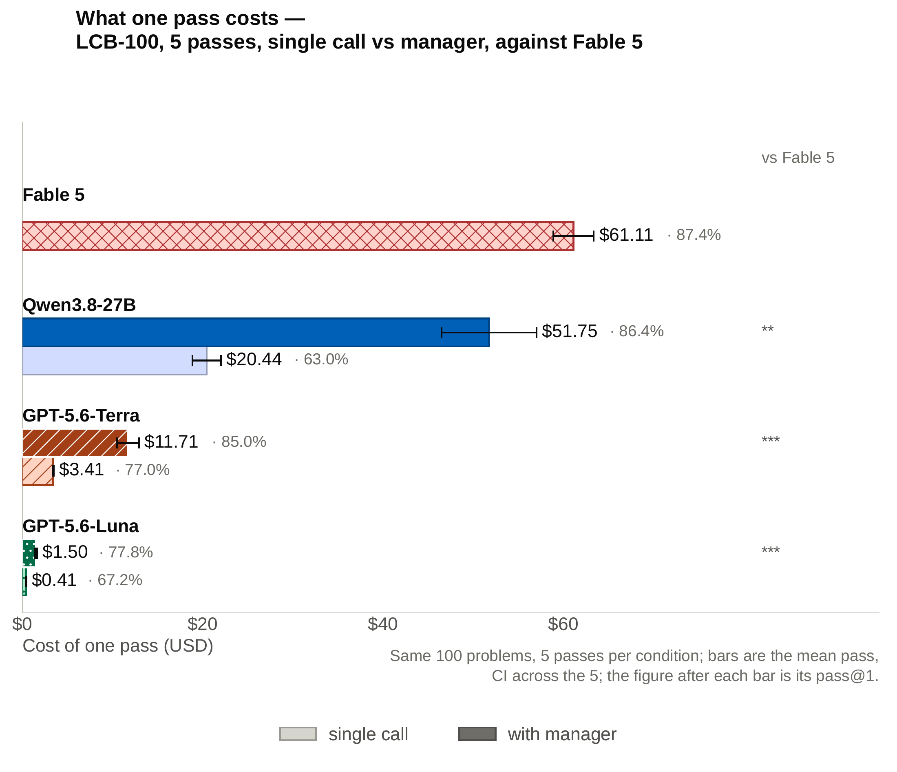

# Zero-Shot Self-Orchestration with Ledger-Based Control Improves Coding in Language Models

## Results





> **Abstract.** Frontier coding performance is typically bought with larger proprietary models at high cost. We introduce ledger-based zero-shot self-orchestration, a training-free method in which fresh instances of one model decompose problems and coordinate through a shared filesystem holding a plan, notes and current solution. Across nine open and closed-weight models on the 100 latest *hard* LiveCodeBench problems, the method yields gains of up to 23.4 percentage points on pinned backends and offers two routes to near-frontier accuracy. Orchestrated GPT-5.6-Terra reaches 85.0% pass@1 against Fable 5's 87.4% at 19% of the cost, and locally served, open-weight Qwen3.8-27B rises from 63.0% to 86.4%. Gains are not universal: some models are unchanged or worse. Transcript analysis attributes the gain to decomposition and persistent context. Inference-time organization can approach frontier coding accuracy at a fraction of the cost, or on self-hostable weights.
>
> — [the paper](paper/iclr2027_conference.pdf)

## Running the code

Needs [uv](https://docs.astral.sh/uv/) and an API key for the model you want to test.

```bash
cd codebase/v2-current
export OPENAI_API_KEY=...

LCB_RELEASE=release_v6 \
ESCALATION_CLOUD_MAX_TOKENS=128000 \
ESCALATION_CLOUD_TIMEOUT=7200 \
MULTIAGENT_MODEL=openai:gpt-5.6-terra \
uv run --no-project --python 3.12 --with datasets --with numpy --with anthropic \
  python escalation/run_bench.py --engine multiagent --only lcb --lcb 100 --parallel 8
```

- `--engine multiagent` runs the manager; `--engine single` is the one-call baseline.
- Other models: `anthropic:<model>`, `dashscope:<model>`, `openrouter:<model>`, each with its own `*_API_KEY`.
- The pass@1 score prints at the end. Results are written to `runs/results.json`, workspaces to `runs/ws/`.
